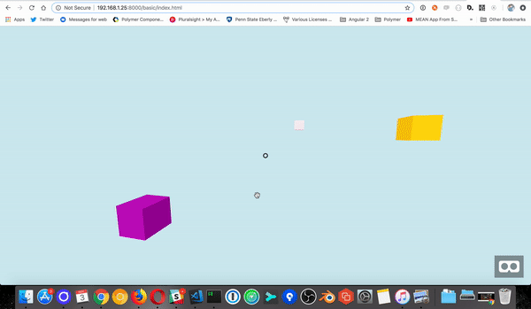

# A-Frame Raycaster Follow Component



This is an A-Frame component for changing the position of an object based on what your raycasting is interacting with.  Useful for raycaster indicators.

## Usage

```
<a-scene>

  <a-box material="color: pink" position="0 3 -18"></a-box>
  <a-box material="color: orange" position="5 2 -8"></a-box>
  <a-box material="color: purple" position="-5 -1 -4"></a-box>

  <a-entity position="0 3 -3" raycaster-follower="targets:a-box;offset:0 -2 0">
    <a-entity id="indicator" geometry="primitive:octahedron;radius:0.73" material="color:#0050ff;width:511.33"></a-entity>
  </a-entity>

</a-scene>
```